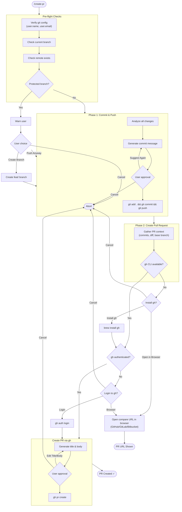
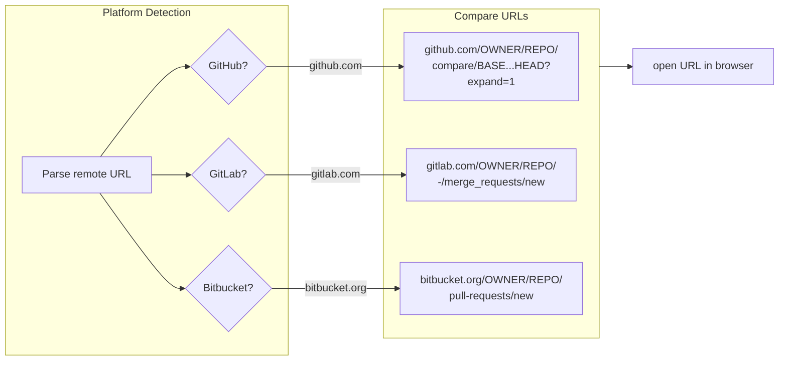
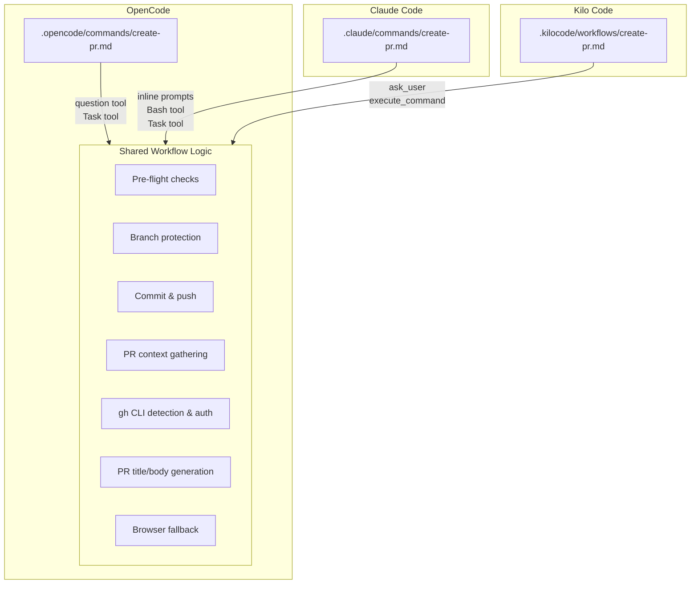

# Create PR — Workflow Diagram

Covers: `/create-pr`

## Command Flow

```mermaid
flowchart TD
    Start(["/create-pr"]) --> PreFlight

    subgraph PreFlight["Pre-flight Checks"]
        PF1["Verify git config\n(user.name, user.email)"]
        PF2["Check current branch"]
        PF3["Check remote exists"]
        PF4{"Protected branch?"}
        PF1 --> PF2 --> PF3 --> PF4
    end

    PF4 -->|No| Phase1
    PF4 -->|Yes| ProtectWarn["Warn user"]
    ProtectWarn --> ProtectChoice{"User choice"}
    ProtectChoice -->|"Push Anyway"| Phase1
    ProtectChoice -->|"Create Branch"| NewBranch["Create feat/<description> branch"]
    ProtectChoice -->|"Cancel"| Abort(["Abort"])
    NewBranch --> Phase1

    subgraph Phase1["Phase 1: Commit & Push"]
        P1A["Analyze all changes"]
        P1B["Generate commit message"]
        P1C{"User approval"}
        P1D["git add . && git commit && git push"]
        P1A --> P1B --> P1C --> P1D
        P1C -->|"Suggest Again"| P1B
        P1C -->|"Cancel"| Abort
    end

    Phase1 --> Phase2

    subgraph Phase2["Phase 2: Create Pull Request"]
        P2A["Gather PR context\n(commits, diff, base branch)"]
        P2B{"gh CLI available?"}
        P2A --> P2B
    end

    P2B -->|Yes| GHCheck{"gh authenticated?"}
    P2B -->|No| GHInstall{"Install gh?"}

    GHInstall -->|"Install gh"| BrewInstall["brew install gh"]
    GHInstall -->|"Open in Browser"| BrowserURL
    GHInstall -->|"Cancel"| Abort

    BrewInstall --> GHCheck
    GHCheck -->|Yes| PRCreate
    GHCheck -->|No| GHAuth{"Login to gh?"}
    GHAuth -->|"Login"| AuthRun["gh auth login"]
    GHAuth -->|"Browser"| BrowserURL
    GHAuth -->|"Cancel"| Abort
    AuthRun --> PRCreate

    subgraph PRCreate["Create PR via gh"]
        PR1["Generate title & body"]
        PR2{"User approval"}
        PR3["gh pr create"]
        PR1 --> PR2 --> PR3
        PR2 -->|"Edit Title/Body"| PR1
        PR2 -->|"Cancel"| Abort
    end

    PRCreate --> PRDone(["PR Created ✓"])

    BrowserURL["Open compare URL in browser\n(GitHub/GitLab/Bitbucket)"] --> BrowserDone(["PR URL Shown"])
```

## PR Fallback Flow

```mermaid
flowchart LR
    subgraph Detect["Platform Detection"]
        D1["Parse remote URL"]
        D1 --> D2{"GitHub?"}
        D1 --> D3{"GitLab?"}
        D1 --> D4{"Bitbucket?"}
    end

    subgraph URLs["Compare URLs"]
        D2 -->|"github.com"| U1["github.com/OWNER/REPO/\ncompare/BASE...HEAD?expand=1"]
        D3 -->|"gitlab.com"| U2["gitlab.com/OWNER/REPO/\n-/merge_requests/new"]
        D4 -->|"bitbucket.org"| U3["bitbucket.org/OWNER/REPO/\npull-requests/new"]
    end

    URLs --> Open["open URL in browser"]
```

## Cross-Tool Compatibility

```mermaid
graph TD
    subgraph Core["Shared Workflow Logic"]
        CL1["Pre-flight checks"]
        CL2["Branch protection"]
        CL3["Commit & push"]
        CL4["PR context gathering"]
        CL5["gh CLI detection & auth"]
        CL6["PR title/body generation"]
        CL7["Browser fallback"]
    end

    subgraph OpenCode["OpenCode"]
        OC[".opencode/commands/create-pr.md"]
        OC -->|"question tool\nTask tool"| Core
    end

    subgraph ClaudeCode["Claude Code"]
        CC[".claude/commands/create-pr.md"]
        CC -->|"inline prompts\nBash tool\nTask tool"| Core
    end

    subgraph KiloCode["Kilo Code"]
        KC[".kilocode/workflows/create-pr.md"]
        KC -->|"ask_user\nexecute_command"| Core
    end
```
