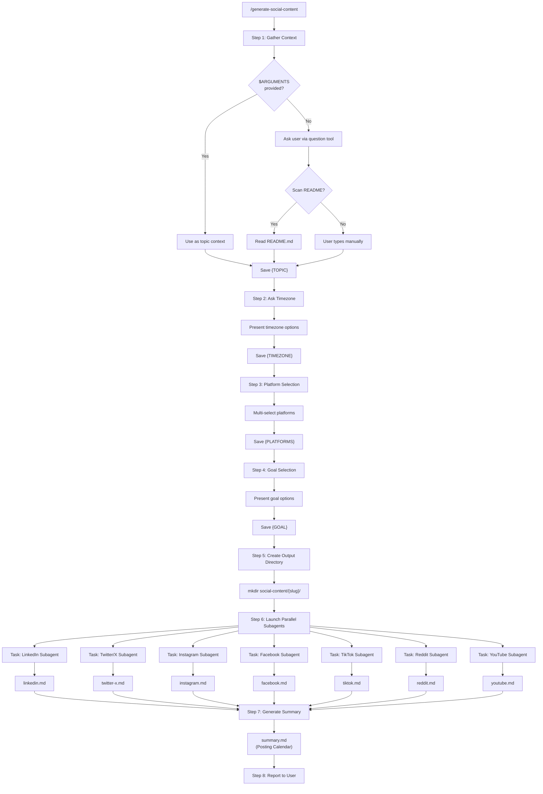
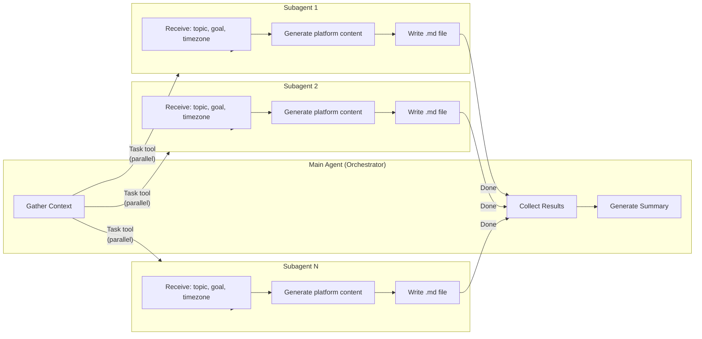
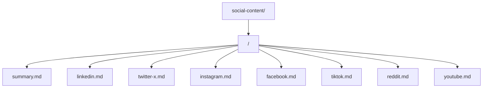
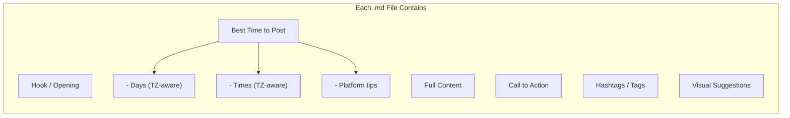
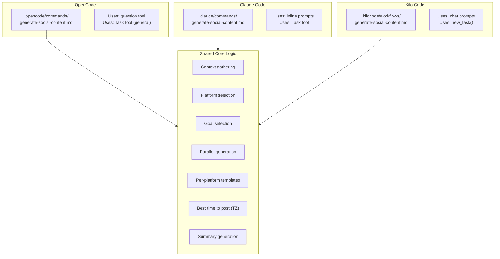

# Generate Social Content — Workflow Diagram

## Command Flow

```mermaid
flowchart TD
    A["/generate-social-content"] --> B["Step 1: Gather Context"]
    B --> B1{"$ARGUMENTS\nprovided?"}
    B1 -->|Yes| B2["Use as topic context"]
    B1 -->|No| B3["Ask user via question tool"]
    B3 --> B4{"Scan README?"}
    B4 -->|Yes| B5["Read README.md"]
    B4 -->|No| B6["User types manually"]
    B5 --> B7["Save {TOPIC}"]
    B2 --> B7
    B6 --> B7

    B7 --> C["Step 2: Ask Timezone"]
    C --> C1["Present timezone options"]
    C1 --> C2["Save {TIMEZONE}"]

    C2 --> D["Step 3: Platform Selection"]
    D --> D1["Multi-select platforms"]
    D1 --> D2["Save {PLATFORMS}"]

    D2 --> E["Step 4: Goal Selection"]
    E --> E1["Present goal options"]
    E1 --> E2["Save {GOAL}"]

    E2 --> F["Step 5: Create Output Directory"]
    F --> F1["mkdir social-content/{slug}/"]

    F1 --> G["Step 6: Launch Parallel Subagents"]
    G --> G1["Task: LinkedIn Subagent"]
    G --> G2["Task: Twitter/X Subagent"]
    G --> G3["Task: Instagram Subagent"]
    G --> G4["Task: Facebook Subagent"]
    G --> G5["Task: TikTok Subagent"]
    G --> G6["Task: Reddit Subagent"]
    G --> G7["Task: YouTube Subagent"]

    G1 --> H1["linkedin.md"]
    G2 --> H2["twitter-x.md"]
    G3 --> H3["instagram.md"]
    G4 --> H4["facebook.md"]
    G5 --> H5["tiktok.md"]
    G6 --> H6["reddit.md"]
    G7 --> H7["youtube.md"]

    H1 --> I["Step 7: Generate Summary"]
    H2 --> I
    H3 --> I
    H4 --> I
    H5 --> I
    H6 --> I
    H7 --> I

    I --> I1["summary.md\n(Posting Calendar)"]

    I1 --> J["Step 8: Report to User"]
```

## Subagent Architecture

```mermaid
flowchart LR
    subgraph Main["Main Agent (Orchestrator)"]
        direction TB
        M1["Gather Context"]
        M2["Collect Results"]
        M3["Generate Summary"]
    end

    subgraph S1["Subagent 1"]
        S1a["Receive: topic, goal, timezone"]
        S1b["Generate platform content"]
        S1c["Write .md file"]
    end

    subgraph S2["Subagent 2"]
        S2a["Receive: topic, goal, timezone"]
        S2b["Generate platform content"]
        S2c["Write .md file"]
    end

    subgraph S3["Subagent N"]
        S3a["Receive: topic, goal, timezone"]
        S3b["Generate platform content"]
        S3c["Write .md file"]
    end

    M1 -->|"Task tool\n(parallel)"| S1
    M1 -->|"Task tool\n(parallel)"| S2
    M1 -->|"Task tool\n(parallel)"| S3

    S1 --> S1a --> S1b --> S1c
    S2 --> S2a --> S2b --> S2c
    S3 --> S3a --> S3b --> S3c

    S1c -->|"Done"| M2
    S2c -->|"Done"| M2
    S3c -->|"Done"| M2

    M2 --> M3
```

## Output Structure

```mermaid
graph TD
    ROOT["social-content/"]
    DIR["<topic-slug>/"]
    S["summary.md"]
    LI["linkedin.md"]
    TW["twitter-x.md"]
    IG["instagram.md"]
    FB["facebook.md"]
    TT["tiktok.md"]
    RD["reddit.md"]
    YT["youtube.md"]

    ROOT --> DIR
    DIR --> S
    DIR --> LI
    DIR --> TW
    DIR --> IG
    DIR --> FB
    DIR --> TT
    DIR --> RD
    DIR --> YT
```

## Per-Platform Content Sections

```mermaid
graph LR
    subgraph Template["Each .md File Contains"]
        T1["Hook / Opening"]
        T2["Full Content"]
        T3["Call to Action"]
        T4["Hashtags / Tags"]
        T5["Visual Suggestions"]
        T6["Best Time to Post"]
        T6a["- Days (TZ-aware)"]
        T6b["- Times (TZ-aware)"]
        T6c["- Platform tips"]
    end

    T6 --> T6a
    T6 --> T6b
    T6 --> T6c
```

## Cross-Tool Compatibility

```mermaid
graph TD
    subgraph OpenCode["OpenCode"]
        OC[".opencode/commands/\ngenerate-social-content.md"]
        OC1["Uses: question tool\nUses: Task tool (general)"]
    end

    subgraph ClaudeCode["Claude Code"]
        CC[".claude/commands/\ngenerate-social-content.md"]
        CC1["Uses: inline prompts\nUses: Task tool"]
    end

    subgraph KiloCode["Kilo Code"]
        KC[".kilocode/workflows/\ngenerate-social-content.md"]
        KC1["Uses: chat prompts\nUses: new_task()"]
    end

    subgraph Core["Shared Core Logic"]
        CL1["Context gathering"]
        CL2["Platform selection"]
        CL3["Goal selection"]
        CL4["Parallel generation"]
        CL5["Per-platform templates"]
        CL6["Best time to post (TZ)"]
        CL7["Summary generation"]
    end

    OC --> Core
    CC --> Core
    KC --> Core
```
