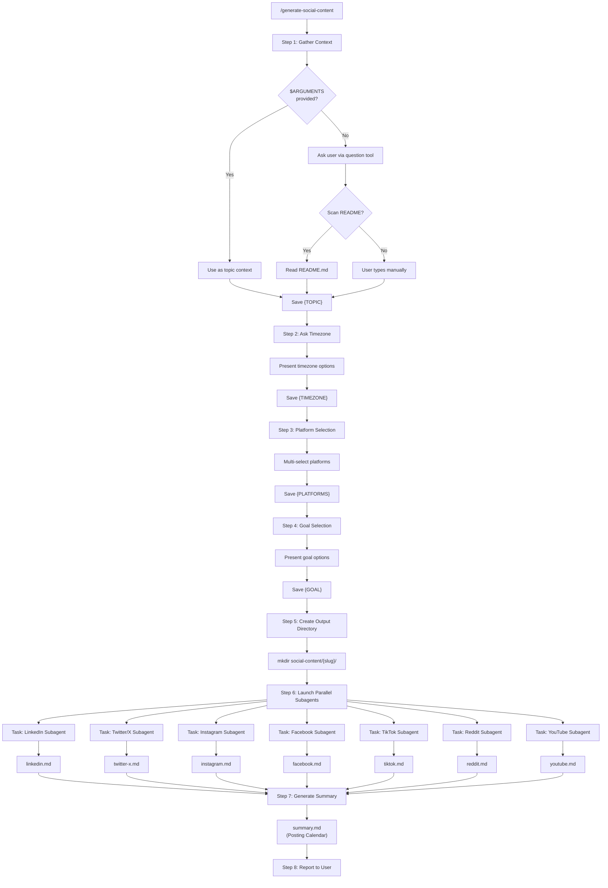
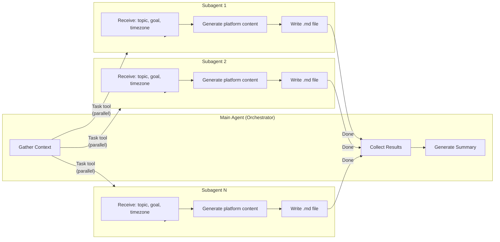
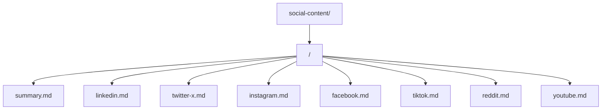
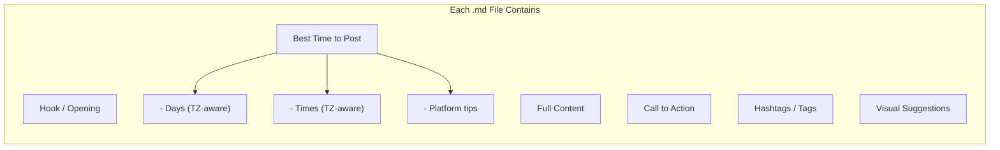

# Generate Social Content — Workflow Diagram

## Command Flow

## Subagent Architecture

## Output Structure

## Per-Platform Content Sections

## Cross-Tool Compatibility

All 8 commands are available across OpenCode, Claude Code, and Kilo Code. Only interaction patterns differ — core workflow logic is shared.

```mermaid
graph TD
    subgraph OpenCode["OpenCode (.opencode/commands/)"]
        OC1["commit-all.md"]
        OC2["commit-staged.md"]
        OC3["push-all.md"]
        OC4["push-staged.md"]
        OC5["create-pr.md"]
        OC6["add-documentation.md"]
        OC7["plan-interview.md"]
        OC8["generate-social-content.md"]
        OC_Uses["question tool, $ARGUMENTS,\nTask tool"]
    end

    subgraph ClaudeCode["Claude Code (.claude/commands/)"]
        CC1["commit-all.md"]
        CC2["commit-staged.md"]
        CC3["push-all.md"]
        CC4["push-staged.md"]
        CC5["create-pr.md"]
        CC6["add-documentation.md"]
        CC7["plan-interview.md"]
        CC8["generate-social-content.md"]
        CC_Uses["allowed-tools frontmatter,\ninline prompts, Task tool"]
    end

    subgraph KiloCode["Kilo Code (.kilocode/workflows/)"]
        KC1["commit-all.md"]
        KC2["commit-staged.md"]
        KC3["push-all.md"]
        KC4["push-staged.md"]
        KC5["create-pr.md"]
        KC6["add-documentation.md"]
        KC7["plan-interview.md"]
        KC8["generate-social-content.md"]
        KC_Uses["ask_user, execute_command,\nnew_task(), write_to_file"]
    end

    subgraph Core["Shared Core Logic"]
        CL1["Pre-flight checks"]
        CL2["Branch protection"]
        CL3["Change analysis"]
        CL4["Commit message generation"]
        CL5["User approval workflow"]
        CL6["Git execution"]
        CL7["PR creation"]
        CL8["Parallel subagents"]
    end

    OC1 & OC2 & OC3 & OC4 & OC5 & OC6 & OC7 & OC8 --> Core
    CC1 & CC2 & CC3 & CC4 & CC5 & CC6 & CC7 & CC8 --> Core
    KC1 & KC2 & KC3 & KC4 & KC5 & KC6 & KC7 & KC8 --> Core
```

