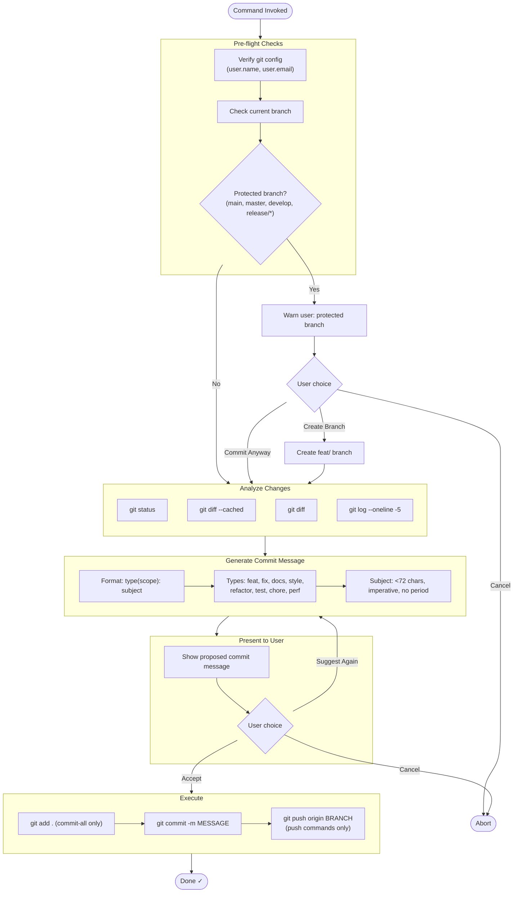
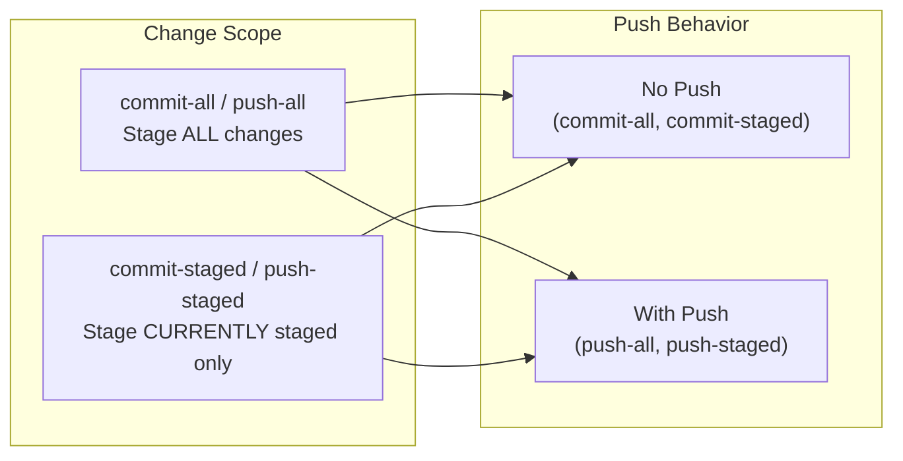
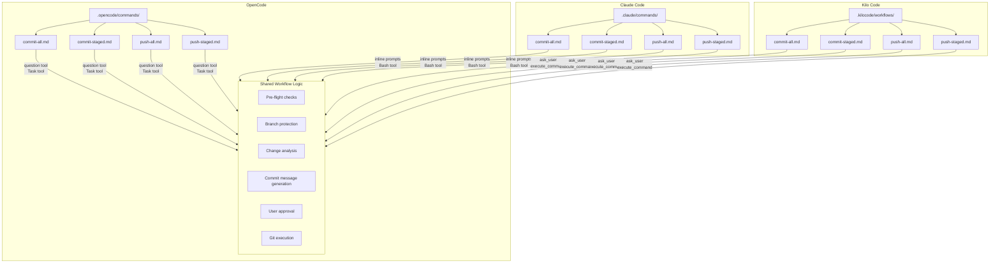

# Git Commit & Push — Workflow Diagram

Covers: `/commit-all`, `/commit-staged`, `/push-all`, `/push-staged`

## Command Flow

```mermaid
flowchart TD
    Start(["Command Invoked"]) --> PreFlight

    subgraph PreFlight["Pre-flight Checks"]
        PF1["Verify git config\n(user.name, user.email)"]
        PF2["Check current branch"]
        PF3{"Protected branch?\n(main, master, develop, release/*)"}
        PF1 --> PF2 --> PF3
    end

    PF3 -->|No| Analyze
    PF3 -->|Yes| ProtectWarn["Warn user: protected branch"]
    ProtectWarn --> ProtectChoice{"User choice"}
    ProtectChoice -->|"Commit Anyway"| Analyze
    ProtectChoice -->|"Create Branch"| NewBranch["Create feat/<description> branch"]
    ProtectChoice -->|"Cancel"| Abort(["Abort"])
    NewBranch --> Analyze

    subgraph Analyze["Analyze Changes"]
        direction TB
        A1["git status"]
        A2["git diff --cached"]
        A3["git diff"]
        A4["git log --oneline -5"]
    end

    Analyze --> Generate

    subgraph Generate["Generate Commit Message"]
        G1["Format: type(scope): subject"]
        G2["Types: feat, fix, docs, style,\nrefactor, test, chore, perf"]
        G3["Subject: <72 chars, imperative, no period"]
        G1 --> G2 --> G3
    end

    Generate --> Present

    subgraph Present["Present to User"]
        P1["Show proposed commit message"]
        P2{"User choice"}
        P1 --> P2
    end

    P2 -->|"Accept"| Execute
    P2 -->|"Suggest Again"| Generate
    P2 -->|"Cancel"| Abort

    subgraph Execute["Execute"]
        E1["git add . (commit-all only)"]
        E2["git commit -m MESSAGE"]
        E3["git push origin BRANCH\n(push commands only)"]
        E1 --> E2 --> E3
    end

    Execute --> Done(["Done ✓"])
```

## Command Variants

```mermaid
graph LR
    subgraph Scope["Change Scope"]
        CA["commit-all / push-all\nStage ALL changes"]
        CS["commit-staged / push-staged\nStage CURRENTLY staged only"]
    end

    subgraph Push["Push Behavior"]
        NP["No Push\n(commit-all, commit-staged)"]
        WP["With Push\n(push-all, push-staged)"]
    end

    CA --> NP
    CA --> WP
    CS --> NP
    CS --> WP
```

## Cross-Tool Compatibility

```mermaid
graph TD
    subgraph Core["Shared Workflow Logic"]
        CL1["Pre-flight checks"]
        CL2["Branch protection"]
        CL3["Change analysis"]
        CL4["Commit message generation"]
        CL5["User approval"]
        CL6["Git execution"]
    end

    subgraph OpenCode["OpenCode"]
        OC_DIR[".opencode/commands/"]
        OC1["commit-all.md"]
        OC2["commit-staged.md"]
        OC3["push-all.md"]
        OC4["push-staged.md"]
        OC_DIR --> OC1 & OC2 & OC3 & OC4
        OC1 & OC2 & OC3 & OC4 -->|"question tool\nTask tool"| Core
    end

    subgraph ClaudeCode["Claude Code"]
        CC_DIR[".claude/commands/"]
        CC1["commit-all.md"]
        CC2["commit-staged.md"]
        CC3["push-all.md"]
        CC4["push-staged.md"]
        CC_DIR --> CC1 & CC2 & CC3 & CC4
        CC1 & CC2 & CC3 & CC4 -->|"inline prompts\nBash tool"| Core
    end

    subgraph KiloCode["Kilo Code"]
        KC_DIR[".kilocode/workflows/"]
        KC1["commit-all.md"]
        KC2["commit-staged.md"]
        KC3["push-all.md"]
        KC4["push-staged.md"]
        KC_DIR --> KC1 & KC2 & KC3 & KC4
        KC1 & KC2 & KC3 & KC4 -->|"ask_user\nexecute_command"| Core
    end
```
