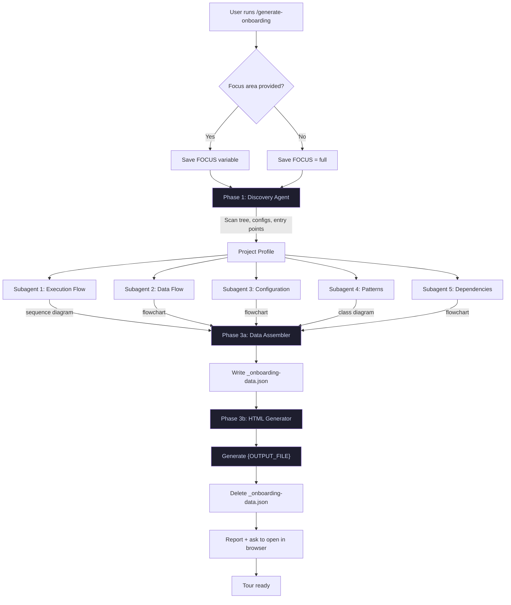

# Onboarding Command Optimization Implementation Plan

> **For agentic workers:** REQUIRED SUB-SKILL: Use superpowers:subagent-driven-development (recommended) or superpowers:executing-plans to implement this plan task-by-task. Steps use checkbox (`- [ ]`) syntax for tracking.

**Goal:** Improve Mermaid diagram reliability and reduce HTML corruption in the generate-onboarding command across all 3 tool formats.

**Architecture:** Two changes applied to all 3 command formats: (1) add Mermaid syntax rules to subagent prompts + modernize Mermaid JS init + add error fallback CSS, (2) split Step 4 into two-stage generation (JSON intermediate then HTML template-fill). The workflow diagram doc is updated to reflect the new pipeline.

**Tech Stack:** Markdown command specs (no executable code)

---

### Task 1: Add Mermaid Syntax Rules to Claude Code Subagent Prompts

**Files:**
- Modify: `.claude/commands/generate-onboarding.md:66-98` (Subagent 1)
- Modify: `.claude/commands/generate-onboarding.md:108-138` (Subagent 2)
- Modify: `.claude/commands/generate-onboarding.md:148-176` (Subagent 3)
- Modify: `.claude/commands/generate-onboarding.md:186-215` (Subagent 4)
- Modify: `.claude/commands/generate-onboarding.md:225-252` (Subagent 5)

- [ ] **Step 1: Add Mermaid rules to Subagent 1 (Execution Flow) prompt**

In `.claude/commands/generate-onboarding.md`, find the Subagent 1 prompt block. Insert the following immediately before the line `If focus is not "full", prioritize the focus area in your trace.` (line 96):

```markdown
Mermaid syntax rules — follow these strictly:
- Wrap ALL node labels in double quotes: A["My Label"] not A[My Label]
- No special characters outside quoted labels (no parentheses, colons, ampersands in bare text)
- Use only these diagram types: sequenceDiagram, flowchart, classDiagram
- No subgraphs with special characters in titles
- Keep diagrams under 20 nodes — simplify if needed
- Test mentally: does every arrow have a valid source and target?
- If unsure about syntax, use a simpler diagram rather than a complex broken one
```

- [ ] **Step 2: Add Mermaid rules to Subagent 2 (Data Flow) prompt**

Same Mermaid rules block. Insert immediately before `Return a structured summary with:` in the Subagent 2 prompt (line 130).

- [ ] **Step 3: Add Mermaid rules to Subagent 3 (Configuration & Setup) prompt**

Same Mermaid rules block. Insert immediately before `Return a structured summary covering:` in the Subagent 3 prompt (line 167).

- [ ] **Step 4: Add Mermaid rules to Subagent 4 (Patterns & Conventions) prompt**

Same Mermaid rules block. Insert immediately before `Return a structured summary with:` in the Subagent 4 prompt (line 206).

- [ ] **Step 5: Add Mermaid rules to Subagent 5 (External Dependencies) prompt**

Same Mermaid rules block. Insert immediately before `Return a structured summary with:` in the Subagent 5 prompt (line 244).

- [ ] **Step 6: Commit**

```bash
git add .claude/commands/generate-onboarding.md
git commit -m "feat(generate-onboarding): add Mermaid syntax rules to Claude Code subagent prompts"
```

---

### Task 2: Modernize Mermaid Init and Add Error Fallback in Claude Code

**Files:**
- Modify: `.claude/commands/generate-onboarding.md:267-288` (Mermaid init block)
- Modify: `.claude/commands/generate-onboarding.md:290` (after Mermaid init, before Layout section)
- Modify: `.claude/commands/generate-onboarding.md:293-300` (Theme section — add error CSS)

- [ ] **Step 1: Replace the Mermaid initialization block**

In `.claude/commands/generate-onboarding.md`, replace lines 269-287 (the entire `<script>` block including the CDN link) with:

```html
<script src="https://cdn.jsdelivr.net/npm/mermaid@11/dist/mermaid.min.js"></script>
<script>
  mermaid.initialize({
    startOnLoad: true,
    theme: 'dark',
    securityLevel: 'loose'
  });
  mermaid.parseError = function(err, hash) {
    console.warn('Mermaid parse error:', err);
  };
  window.addEventListener('load', function() {
    document.querySelectorAll('.mermaid[data-processed="true"]').forEach(function(el) {
      if (!el.querySelector('svg')) {
        el.classList.add('mermaid-error');
        el.setAttribute('title', 'Diagram could not render — showing source');
      }
    });
  });
</script>
```

- [ ] **Step 2: Add error fallback CSS to the Theme section**

In the **Theme** section (after the light theme line, around line 300), add a new subsection:

```markdown
**Diagram Error Fallback:**
- `.mermaid-error` class: dashed border using `var(--secondary)`, monospace font, `white-space: pre-wrap`, `opacity: 0.7`
- `.mermaid-error::before` pseudo-element displays: "Diagram could not render — raw source shown below" in `var(--accent)` color
- `<noscript>` block: sets `.mermaid` to `pre-wrap` monospace and shows "JavaScript is required for interactive navigation and diagram rendering."
```

- [ ] **Step 3: Commit**

```bash
git add .claude/commands/generate-onboarding.md
git commit -m "feat(generate-onboarding): modernize Mermaid init and add error fallback in Claude Code"
```

---

### Task 3: Add Two-Stage Generation to Claude Code

**Files:**
- Modify: `.claude/commands/generate-onboarding.md:254-353` (Step 4: Generate HTML Tour)

- [ ] **Step 1: Replace Step 4 with two-stage generation**

Replace the current Step 4 content (lines 254-353) with the following. Keep the `## Step 4: Generate HTML Tour` heading and the `1. Create the docs directory` bash command, then replace everything else:

```markdown
## Step 4: Generate HTML Tour

After ALL subagents complete, generate the onboarding HTML file in two stages.

### Stage A: Assemble Tour Data

1. Create the docs directory:
```
Bash(mkdir -p docs)
```

2. Combine all subagent outputs into a structured JSON file at `docs/_onboarding-data.json`. The JSON must follow this schema:

```json
{
  "projectName": "string — from directory name or package config",
  "language": "string — primary language",
  "framework": "string — primary framework or 'None'",
  "description": "string — brief project description from README or config",
  "dependencies": ["string — top 5-10 key dependencies"],
  "commands": {
    "build": "string or null",
    "dev": "string or null",
    "test": "string or null"
  },
  "steps": [
    {
      "title": "string — step title from execution flow",
      "filePath": "string — e.g. src/index.ts:1-30",
      "narrative": "string — 2-4 paragraphs explaining the step",
      "code": "string — 10-50 lines of source code",
      "highlightLines": [1, 5, 8],
      "keyPoints": ["string — 2-3 bullet points"],
      "diagram": "string — raw Mermaid source, or null"
    }
  ],
  "architectureDiagram": "string — raw Mermaid source from Subagent 4, or null",
  "dataFlowDiagram": "string — raw Mermaid source from Subagent 2, or null",
  "integrationDiagram": "string — raw Mermaid source from Subagent 5, or null"
}
```

Use data from all 5 subagents:
- Steps array: from Subagent 1 (Execution Flow) — each flow step becomes one entry
- Narrative for each step: weave in findings from Subagent 2 (data flow), Subagent 4 (patterns), and Subagent 5 (dependencies)
- Commands: from Subagent 3 (Configuration)
- Diagrams: from each respective subagent

If a subagent failed, set its fields to `null` and note the gap in the relevant step's narrative.

### Stage B: Generate HTML from Data

Read `docs/_onboarding-data.json` and generate `{OUTPUT_FILE}` as a self-contained single-page HTML file.

The HTML generation is template-filling from the JSON data. For each field in the JSON:
- `projectName`, `language`, `framework`, `description` → Step 1: Project Overview content
- `dependencies` → Project Overview dependency list
- `commands` → Project Overview "How to Run" section
- `steps[]` → Steps 2-N, one tour step per entry
- `steps[].code` → Syntax-highlighted code block with `highlightLines` applied
- `steps[].diagram` → `<pre class="mermaid">` block (skip if null)
- `architectureDiagram`, `dataFlowDiagram`, `integrationDiagram` → Mermaid blocks in Project Overview

### Stage C: Cleanup

Delete the temporary data file:
```
Bash(rm -f docs/_onboarding-data.json)
```
```

- [ ] **Step 2: Verify the HTML Requirements section still follows Stage B**

Make sure the existing HTML Requirements subsections (Layout, Theme with new error fallback, Code Blocks, Navigation, Print, Responsive) remain in Step 4 after Stage B, serving as instructions for how the HTML should be structured. These sections do not change — they are already in the file from the original version plus Task 2's additions.

- [ ] **Step 3: Commit**

```bash
git add .claude/commands/generate-onboarding.md
git commit -m "feat(generate-onboarding): add two-stage generation (JSON + HTML) to Claude Code"
```

---

### Task 4: Apply Same Changes to OpenCode Format

**Files:**
- Modify: `.opencode/commands/generate-onboarding.md:64-98` (Subagent 1 prompt)
- Modify: `.opencode/commands/generate-onboarding.md:100-138` (Subagent 2 prompt)
- Modify: `.opencode/commands/generate-onboarding.md:140-176` (Subagent 3 prompt)
- Modify: `.opencode/commands/generate-onboarding.md:178-215` (Subagent 4 prompt)
- Modify: `.opencode/commands/generate-onboarding.md:217-252` (Subagent 5 prompt)
- Modify: `.opencode/commands/generate-onboarding.md:254-385` (Step 4 + HTML requirements)

Apply the identical changes from Tasks 1-3, adapted for OpenCode format:

- [ ] **Step 1: Add Mermaid syntax rules to all 5 subagent prompts**

Same Mermaid rules block as Task 1, inserted at the same position in each subagent prompt (before the "Return a structured summary" or "If focus is not full" line).

- [ ] **Step 2: Replace Mermaid init block**

Same modernized init block as Task 2 Step 1. The OpenCode file has the identical Mermaid init code at lines 269-287.

- [ ] **Step 3: Add error fallback CSS to Theme section**

Same error fallback text as Task 2 Step 2.

- [ ] **Step 4: Replace Step 4 with two-stage generation**

Same two-stage content as Task 3 Step 1, but use OpenCode bash syntax (no `Bash()` wrapper — just fenced code blocks with the commands).

The `mkdir -p docs` and `rm -f docs/_onboarding-data.json` commands stay as plain fenced code blocks (OpenCode format uses backtick-wrapped commands).

- [ ] **Step 5: Commit**

```bash
git add .opencode/commands/generate-onboarding.md
git commit -m "feat(generate-onboarding): add Mermaid reliability and two-stage generation to OpenCode"
```

---

### Task 5: Apply Same Changes to Kilo Code Format

**Files:**
- Modify: `.kilocode/workflows/generate-onboarding.md:64-96` (Subtask 1 prompt)
- Modify: `.kilocode/workflows/generate-onboarding.md:98-130` (Subtask 2 prompt)
- Modify: `.kilocode/workflows/generate-onboarding.md:132-163` (Subtask 3 prompt)
- Modify: `.kilocode/workflows/generate-onboarding.md:165-197` (Subtask 4 prompt)
- Modify: `.kilocode/workflows/generate-onboarding.md:199-229` (Subtask 5 prompt)
- Modify: `.kilocode/workflows/generate-onboarding.md:231-363` (Step 4 + HTML requirements)

Apply the identical changes from Tasks 1-3, adapted for Kilo Code format:

- [ ] **Step 1: Add Mermaid syntax rules to all 5 subtask prompts**

Same Mermaid rules block as Task 1, inserted at the same position in each subtask prompt. Note: Kilo Code calls them "subtasks" not "subagents".

- [ ] **Step 2: Replace Mermaid init block**

Same modernized init block as Task 2 Step 1.

- [ ] **Step 3: Add error fallback CSS to Theme section**

Same error fallback text as Task 2 Step 2.

- [ ] **Step 4: Replace Step 4 with two-stage generation**

Same two-stage content as Task 3 Step 1, but use Kilo Code syntax:
- `mkdir -p docs` → wrapped in `execute_command` with backticks
- `rm -f docs/_onboarding-data.json` → wrapped in `execute_command` with backticks
- File writes use `write_to_file` instead of `Write` tool

- [ ] **Step 5: Commit**

```bash
git add .kilocode/workflows/generate-onboarding.md
git commit -m "feat(generate-onboarding): add Mermaid reliability and two-stage generation to Kilo Code"
```

---

### Task 6: Update Workflow Diagram Documentation

**Files:**
- Modify: `docs/generate-onboarding-workflow.md` (entire file)

- [ ] **Step 1: Update the pipeline Mermaid diagram**

In `docs/generate-onboarding-workflow.md`, replace the pipeline Mermaid flowchart (lines 8-36) with:



- [ ] **Step 2: Update Phase 3 description**

Replace the current "Phase 3: Tour Builder" section (lines 78-99) with:

```markdown
## Phase 3: Two-Stage Tour Generation

### Phase 3a: Data Assembler

Combines all subagent outputs into `docs/_onboarding-data.json`:

| Field | Source |
|-------|--------|
| `projectName`, `language`, `framework` | Discovery |
| `steps[]` | Subagent 1 (Execution Flow) |
| `steps[].narrative` | Subagents 1, 2, 4, 5 combined |
| `commands` | Subagent 3 (Configuration) |
| `architectureDiagram` | Subagent 4 (Patterns) |
| `dataFlowDiagram` | Subagent 2 (Data Flow) |
| `integrationDiagram` | Subagent 5 (Dependencies) |

### Phase 3b: HTML Generator

Reads `docs/_onboarding-data.json` and generates `{OUTPUT_FILE}` by template-filling the HTML structure from the JSON data. After HTML is written, deletes `_onboarding-data.json`.
```

- [ ] **Step 3: Add Mermaid reliability note to HTML Output section**

In the "HTML Output" section (lines 101-110), add after the existing bullet list:

```markdown
- Mermaid.js pinned to v11 (stable) with `startOnLoad: true`
- `parseError` handler isolates broken diagrams — one failure doesn't break others
- `.mermaid-error` CSS class provides graceful fallback for broken diagrams
- `<noscript>` fallback for non-JS environments
```

- [ ] **Step 4: Commit**

```bash
git add docs/generate-onboarding-workflow.md
git commit -m "docs(generate-onboarding): update workflow diagram for two-stage pipeline and Mermaid reliability"
```
